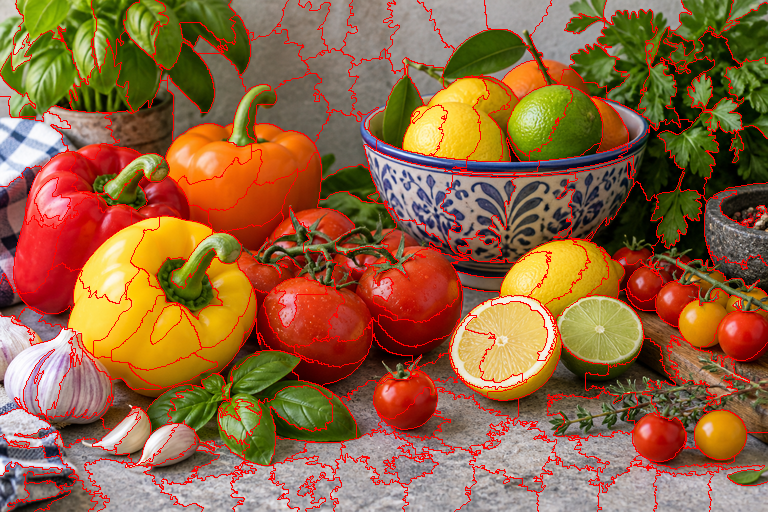

# SLIC Superpixel Segmentation

[](https://github.com/Bahareh527/slic-superpixel-segmentation/actions/workflows/ci.yml)
[](https://www.python.org/)
[](LICENSE)

A readable, from-scratch Python implementation of **Simple Linear Iterative Clustering (SLIC)**. The project clusters pixels in five-dimensional CIELAB and image-coordinate space, moves seeds away from strong gradients, and enforces connected superpixels.



## Why this project

This repository turns Bahareh Keshavarz's VUB multimedia coursework into a reproducible software project. The clustering algorithm is implemented directly with NumPy; OpenCV is used only for RGB-to-CIELAB conversion. It includes a command-line interface, installable package, automated tests, continuous integration, and a licensing-safe demonstration image.

## Installation

```bash
git clone https://github.com/Bahareh527/slic-superpixel-segmentation.git
cd slic-superpixel-segmentation
python -m venv .venv
# Windows: .venv\Scripts\activate
# macOS/Linux: source .venv/bin/activate
python -m pip install -e .
```

## Quick start

```bash
slic-segment examples/input/demo_still_life.png \
  --segments 200 \
  --compactness 10 \
  --output result.png
```

Or use the Python API:

```python
from slic_superpixels import load_rgb_image, overlay_boundaries, save_rgb_image, slic

image = load_rgb_image("examples/input/demo_still_life.png")
result = slic(image, n_segments=200, compactness=10.0)
overlay = overlay_boundaries(image, result.labels)
save_rgb_image("result.png", overlay)

print(result.n_superpixels, result.iterations, result.residual)
```

## How SLIC works

1. Convert the input image from RGB to perceptually meaningful CIELAB color space.
2. Place approximately `K` regularly spaced cluster centers and move each to a low-gradient neighbor.
3. Assign pixels within each center's local `2S x 2S` window using a combined color-and-spatial distance.
4. Recompute cluster centers and repeat until convergence or the iteration limit.
5. Merge small disconnected components to produce a connected label map.

`compactness` controls the trade-off between color adherence and regular shape. Lower values follow image boundaries more closely; higher values produce more regular superpixels.

## Reproduce the examples

```bash
python scripts/generate_examples.py
```

The input is an original AI-generated demo photograph made for this repository; it contains no brands, text, or watermark. Segmentation outputs are deterministic for a fixed input and parameter set.

## Quality checks

```bash
python -m pip install -e ".[dev]"
ruff check .
pytest
```

Tests cover validation, deterministic segmentation, connectivity, boundary extraction, image I/O, and the command-line workflow.

## Reference

This implementation follows the method described by Achanta et al.:

> R. Achanta, A. Shaji, K. Smith, A. Lucchi, P. Fua, and S. Susstrunk, “SLIC Superpixels Compared to State-of-the-art Superpixel Methods,” *IEEE TPAMI*, 34(11), 2274–2282, 2012. [doi:10.1109/TPAMI.2012.120](https://doi.org/10.1109/TPAMI.2012.120)

This repository is an independent educational implementation and is not affiliated with the paper's authors or EPFL.

## License

The source code is released under the [MIT License](LICENSE). The repository's original demo image may be reused under the same license.
